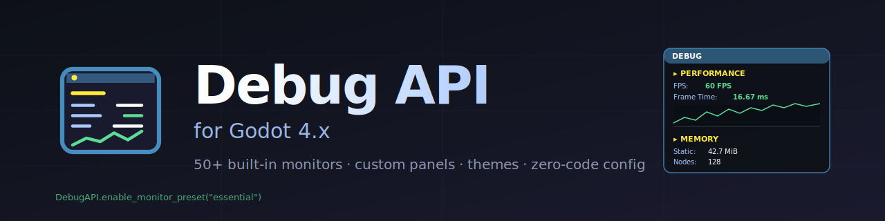

<div align="center">

<a href="#"></a>

<br/>


<br/><br/>

**Universal, scalable, production-ready debugging for Godot 4.x.**

*Drop in. Pick a preset. Watch FPS, memory, GPU, physics, render counters and 50+ other metrics — without writing a single Label.*

<br/>

[🇬🇧 English](#-english) · [🇪🇸 Español](#-español) · [🇫🇷 Français](#-français) · [🇩🇪 Deutsch](#-deutsch) · [🇧🇷 Português](#-português)

</div>

---

<a id="-english"></a>
<details open>
<summary><h2>🇬🇧 English</h2></summary>

### 📋 Table of Contents

1. [Overview](#overview)
2. [Features](#features)
3. [Architecture](#architecture)
4. [Installation — four modes](#installation)
5. [Quick Start (60 seconds)](#quick-start)
6. [Step-by-Step Tutorial](#tutorial)
7. [Built-in Monitors Catalog](#monitors)
8. [Custom Panels & Widgets](#custom-panels)
9. [Widget Reference](#widget-reference)
10. [Themes](#themes)
11. [Configuration Reference (DebugSettings)](#configuration)
12. [Hotkeys & Input Actions](#hotkeys)
13. [Export & Persistence](#export)
14. [Performance Notes](#performance)
15. [Troubleshooting](#troubleshooting)
16. [API Reference](#api-reference)
17. [Migration from v0.x](#migration)

---

<a id="overview"></a>
### 🎮 Overview

**Debug API** turns the boilerplate of *"show FPS, show this variable, show that timer"* into a one-line declaration. Drop the addon in, enable the plugin, and you get:

- ~50 **built-in monitors** (FPS, frame time, memory, GPU, draw calls, physics, scene tree, audio, network, system info, ...) that you can enable individually, by category, or with named presets.
- A **declarative widget API** for custom variables — bind any value to a `TextWidget` / `ProgressWidget` / `GraphWidget` / etc. and it auto-refreshes.
- **Inspector-driven configuration** through a `DebugSettings` resource — every option is also exposed via code.
- **Themes**, anchors, collapsible sections, custom fonts, optional title bar, click-through, hotkeys via `InputMap` actions, JSON/CSV/TXT export, auto-export on interval, snapshot persistence, conditional debug-only initialization.
- **Smart-diff** updates and **per-widget refresh throttling** so a full preset stays under 1 ms/frame even with 50+ widgets.

> **Version:** `v1.0` · **Engine:** Godot 4.0+ · **Language:** GDScript · **Type:** Plugin (autoload + Resource + Bootstrap node)

**The problem.** Every project re-implements `Label` + `_process` to display FPS, then variables, then timers. Lots of CanvasLayers, formatting code, hotkey handling.

**The solution.** A central API that owns the panel rendering and lets you declare *what* to show, not *how* to show it.

---

<a id="features"></a>
### ✨ Features

| Category | What you get |
|---|---|
| **Built-in monitors** | FPS (current/avg/min/max/graph), frame time, process time, physics process, navigation process, static memory + peak, message queue, video memory, texture memory, buffer memory, total objects, node count, resource count, orphan nodes, render objects/primitives/draw calls, GPU name/vendor/type, rendering method, physics 2D/3D bodies/pairs/islands, audio latency, window/screen size/position/DPI/refresh rate, aspect ratio, fullscreen/window mode/vsync, OS, CPU, cores, architecture, engine version, locale, debug build flag, time scale, physics tps, uptime, system time, mouse position, joypads, current scene, scene-tree node count, multiplayer ID, peers. |
| **Widgets** | Text, Progress bar, Graph (history), Conditional (boolean), Coloured (threshold-driven), Timer, Vector. |
| **Presets** | `minimal`, `essential`, `performance`, `memory`, `rendering`, `system`, `display`, `full`. |
| **Themes** | `Default`, `Dark`, `Light`, `Neon`, `Retro`, `Minimal`, `Solarized` + full custom. |
| **Layout** | 8 anchor presets (corners, top/bottom centre, centre, free), edge margins, padding, corner radius, border, custom font, optional title bar, scrollable when content exceeds `max_height`. |
| **Behaviour** | Collapsible sections, click-through, per-panel toggle (key + InputMap action), global toggle, export hotkey, auto-export every N s, only-in-debug-build flag, paused mode. |
| **Export** | TXT (default), JSON, CSV — auto-detected by extension. |
| **Persistence** | `save_settings(...)` / `load_settings(...)` / `snapshot_settings()` — round-trip your runtime customizations to a `.tres`. |
| **Auto-config** | Drop `res://debug_settings.tres` and it's applied on `_ready` — zero code. |
| **Performance** | Smart-diff (skip Label assignment when value unchanged), per-widget `update_interval`, hidden widgets skipped, paused-state for instant on/off, `get_perf_stats()`. |
| **Compatibility** | Godot 4.0+, headless-safe, Forward+ / Mobile / Compatibility renderers, multi-platform. |

---

<a id="architecture"></a>
### 🏗️ Architecture

```
DebugAPI (autoload OR DebugBootstrap-managed)
│
├── _process()  ── DebugMonitors.tick()  (1 float/frame for FPS history)
│
├── Auto panel  ── "__auto__"          (built-in monitors live here)
│   └── sections by category (Performance, Memory, Display, ...)
│
└── Custom panels (your code)
    └── DebugPanel ─ sections ─ widgets
                                │
                                ├── TextWidget
                                ├── ProgressWidget
                                ├── GraphWidget
                                ├── ConditionalWidget
                                ├── ColoredWidget
                                ├── TimerWidget
                                └── VectorWidget
```

```
res://addons/debug_api/
├── plugin.cfg              # plugin manifest
├── plugin.gd               # EditorPlugin (auto-registers the "DebugAPI" autoload)
├── DebugAPI.gd             # entry point (NO class_name — autoload owns the name)
├── DebugPanel.gd           # panel hosting widgets
├── DebugWidgets.gd         # widget classes (Text, Progress, Graph, ...)
├── DebugMonitors.gd        # registry of built-in monitors
├── DebugThemes.gd          # named colour presets
├── DebugSettings.gd        # Resource — the "config from inspector" path
├── DebugBootstrap.gd       # drop-in Node for projects that don't want autoloads
└── examples/
    ├── DebugExample.gd            # custom panel + auto-monitors
    ├── AutoMonitorsExample.gd     # minimal auto-monitor demo
    ├── BootstrapExample.gd        # no-autoload setup
    └── AdvancedConfigExample.gd   # themes, hotkeys, JSON export, scrollable panel
```

---

<a id="installation"></a>
### 📦 Installation — four modes

Pick **one**. Each is fully production-grade.

#### ① Plugin — recommended

1. Copy `addons/debug_api/` into your project's `res://addons/` directory.
2. **Project Settings → Plugins → Debug API → enable.**
3. Use anywhere:
   ```gdscript
   func _ready():
       DebugAPI.enable_monitor_preset("essential")
   ```

The plugin auto-registers an autoload named **DebugAPI**. The script `DebugAPI.gd` deliberately has **no `class_name`** — its name is reserved for the autoload (Godot 4.4+ rejects class_name + autoload sharing a name).

#### ② Manual autoload

If you don't want plugin enabled (e.g. CI, headless), register the autoload yourself:

* **Project Settings → Autoload** → Path: `res://addons/debug_api/DebugAPI.gd`, Name: `DebugAPI` → **Add**.

Same code as Method ①.

#### ③ Bootstrap node — no autoload

Drag a **DebugBootstrap** node into your main scene. From the inspector:

* either pick a `quick_preset` (none / minimal / essential / performance / memory / rendering / system / display / full),
* or assign a `DebugSettings.tres` resource for full control.

Access from code via `bootstrap.api`. This mode is ideal for libraries, plugins of plugins, or projects that strictly avoid autoloads.

#### ④ Pure instance / library mode

For tests, embedded contexts, or maximum decoupling:

```gdscript
const DebugAPIScript = preload("res://addons/debug_api/DebugAPI.gd")

var api := DebugAPIScript.new()
add_child(api)
api.enable_monitor("fps")
```

`DebugAPI.gd` has no `class_name`, so you reach it through `preload(...)`. Everything else (`DebugPanel`, `DebugSettings`, `DebugMonitors`, `DebugThemes`, `DebugWidgets`, `DebugBootstrap`) **does** have `class_name` — you can refer to them directly.

---

<a id="quick-start"></a>
### 🚀 Quick Start (60 seconds)

After installing the plugin (Method ①):

```gdscript
extends Node

func _ready():
    DebugAPI.enable_monitor_preset("essential")
```

Run the project. The panel shows FPS, frame time, static memory, node count and window size. **Press F1** to toggle visibility.

Want everything?

```gdscript
DebugAPI.enable_all_monitors()
```

Want only FPS?

```gdscript
DebugAPI.enable_monitor("fps")
```

Want a different look?

```gdscript
DebugAPI.apply_theme("neon")
```

Done. Read on for the full tour.

---

<a id="tutorial"></a>
### 📖 Step-by-Step Tutorial

#### Step 1 — Install

Copy `addons/debug_api/` into your project. Enable the plugin in Project Settings → Plugins.

You should see no errors in the Output panel and a new autoload "DebugAPI" listed in Project Settings → Autoload.

#### Step 2 — Show your first metric

Anywhere in your code:

```gdscript
extends Node

func _ready():
    DebugAPI.enable_monitor("fps")
```

Run. The FPS counter appears top-left. Press F1 to hide / show.

#### Step 3 — Pick a preset

Replace the call with:

```gdscript
DebugAPI.enable_monitor_preset("performance")
```

Now you see FPS, average FPS, min FPS, max FPS, frame time, process time and physics process. Other presets:

```
"minimal"     → FPS only
"essential"   → FPS, frame time, memory, nodes, window size
"performance" → FPS family, frame time, process times
"memory"      → static, peak, video, texture, buffer, orphans
"rendering"   → objects, primitives, draw calls, GPU info
"system"      → OS, CPU, cores, GPU, engine version
"display"     → window/screen size, DPI, refresh, fullscreen, vsync
"full"        → everything (~50 widgets)
```

You can also enable a category in one shot:

```gdscript
DebugAPI.enable_monitor_category("memory")
```

#### Step 4 — Configure from the inspector

Programmatic config is great, but for "set and forget" you can drive everything from a `DebugSettings` resource.

1. In the FileSystem dock, right-click → **New Resource…** → search **DebugSettings** → Create.
2. Save it as `res://debug_settings.tres`.
3. Open it. The inspector lists groups: **Quick Setup**, **By Category**, **Specific Monitors**, **Position**, **Panel Behavior**, **Hotkeys**, **Panel Layout**, **Title Bar**, **Style**, **Export**.
4. Tick the categories you want. Adjust the colours, hotkey, anchor — whatever you fancy.
5. Run the project. **`DebugAPI` auto-loads `res://debug_settings.tres` on `_ready` and applies it.** No code needed.

If you prefer a different filename or want to apply on demand:

```gdscript
var settings: DebugSettings = load("res://my_settings.tres")
DebugAPI.apply_settings(settings)
```

The auto-load also looks at `res://addons/debug_api/debug_settings.tres` and `user://debug_settings.tres`.

#### Step 5 — Custom widgets

The built-in monitors cover engine state. For *your* state, build a panel:

```gdscript
extends CharacterBody2D

var health: float = 100.0
var coyote_timer: Timer

var debug_panel: DebugPanel


func _ready():
    coyote_timer = Timer.new()
    coyote_timer.wait_time = 0.12
    coyote_timer.one_shot = true
    add_child(coyote_timer)

    debug_panel = DebugAPI.create_panel("Player", self, {
        "anchor": DebugPanel.ANCHOR_TOP_RIGHT,
        "edge_margin": Vector2(8, 8),
    })

    debug_panel.add_text_widget("STATE", "Position", func(): return global_position, "(%.0f, %.0f)")
    debug_panel.add_progress_widget("STATE", "Health", func(): return health, 0.0, 100.0)
    debug_panel.add_timer_widget("TIMERS", "Coyote", coyote_timer)
    debug_panel.add_conditional_widget("STATE", "Grounded",
        func(): return is_on_floor(), func(v): return v, "🟢 YES", "🔴 NO")
```

The panel updates itself every frame. The `Player` panel has its own toggle key (default F1, configurable via the config dictionary).

#### Step 6 — Apply a theme

```gdscript
DebugAPI.apply_theme("dark")
```

Available: `default`, `dark`, `light`, `neon`, `retro`, `minimal`, `solarized`. The theme replaces the auto-panel colours; your monitors stay enabled and re-skin instantly.

From the inspector, set `theme_preset` on `DebugSettings` to anything other than `Custom` and the individual colour pickers below it are ignored (the theme wins).

#### Step 7 — Export hotkey

```gdscript
DebugAPI.export_hotkey = KEY_F3
DebugAPI.export_path   = "user://debug.json"
DebugAPI.export_format = DebugAPI.EXPORT_JSON
```

Press F3 in-game and the current state of every panel is written to `user://debug.json`. Format auto-detection works too:

```gdscript
DebugAPI.export_debug_data("user://snapshot.csv")  # → CSV
DebugAPI.export_debug_data("user://snapshot.json") # → JSON
DebugAPI.export_debug_data("user://snapshot.txt")  # → TXT
```

For periodic snapshots:

```gdscript
DebugAPI.auto_export_path     = "user://logs/auto.json"
DebugAPI.auto_export_format   = DebugAPI.EXPORT_JSON
DebugAPI.auto_export_interval = 30.0   # every 30 s
```

#### Step 8 — Persist your customizations

You spent ten minutes tweaking colours, hotkey, layout. Save the result:

```gdscript
var snap := DebugAPI.snapshot_settings()
DebugAPI.save_settings(snap, "user://my_debug.tres")
```

Next launch:

```gdscript
var loaded := DebugAPI.load_settings("user://my_debug.tres")
if loaded:
    DebugAPI.apply_settings(loaded)
```

Or ship the `.tres` with your project at `res://debug_settings.tres` and the auto-load handles it.

That's the whole tour. The remaining sections are reference material.

---

<a id="monitors"></a>
### 📊 Built-in Monitors Catalog

Every monitor has a stable string id. Use it with `enable_monitor(id)` or include it in `DebugSettings.monitor_ids`.

#### Performance — `category: "performance"`

| id | label | widget | refresh |
|---|---|---|---|
| `fps` | FPS | colored | per frame |
| `fps_avg` | Avg FPS | colored | per frame |
| `fps_min` | Min FPS | colored | per frame |
| `fps_max` | Max FPS | text | per frame |
| `frame_time` | Frame Time | colored (ms) | per frame |
| `process_time` | Process Time | text | per frame |
| `physics_process_time` | Physics Process | text | per frame |
| `navigation_process_time` | Navigation Process | text | per frame |
| `fps_graph` | FPS Graph | graph | per frame |

#### Memory — `category: "memory"`

| id | label | widget | refresh |
|---|---|---|---|
| `memory_static` | Static Memory | text | per frame |
| `memory_static_max` | Peak Memory | text | per frame |
| `message_queue_max` | Message Queue Peak | text | per frame |
| `video_memory` | Video Memory | text | per frame |
| `texture_memory` | Texture Memory | text | per frame |
| `buffer_memory` | Buffer Memory | text | per frame |

#### Objects — `category: "objects"`

| id | label | widget | refresh |
|---|---|---|---|
| `object_count` | Total Objects | text | per frame |
| `node_count` | Nodes | text | per frame |
| `resource_count` | Resources | text | per frame |
| `orphan_nodes` | Orphan Nodes | colored | per frame |

#### Rendering — `category: "rendering"`

| id | label | widget | refresh |
|---|---|---|---|
| `total_objects` | Objects in Frame | text | per frame |
| `total_primitives` | Primitives | text | per frame |
| `total_draw_calls` | Draw Calls | text | per frame |
| `rendering_method` | Rendering Method | text | every 60 s |
| `gpu_name` | GPU | text | every 60 s |
| `gpu_vendor` | GPU Vendor | text | every 60 s |
| `gpu_type` | GPU Type | text | every 60 s |

#### Physics — `category: "physics"`

`active_bodies_2d`, `collision_pairs_2d`, `physics_islands_2d`, `active_bodies_3d`, `collision_pairs_3d`, `physics_islands_3d`. All `int`, refresh per frame.

#### Audio — `category: "audio"`

`audio_latency` — float ms, refresh every 1 s.

#### Display — `category: "display"`

`window_size`, `window_position`, `screen_size`, `screen_dpi`, `screen_refresh_rate`, `aspect_ratio`, `fullscreen` (conditional), `window_mode`, `vsync_mode`. Refresh 0.5 – 5 s depending on metric.

#### System — `category: "system"`

`os_name`, `os_version`, `cpu_model`, `cpu_cores`, `architecture`, `engine_version`, `locale`, `debug_build`. Mostly refresh every 60 s (essentially immutable values).

#### Time — `category: "time"`

`time_scale` (per frame), `physics_ticks_per_second` (5 s), `uptime` (1 s), `system_time` (0.5 s).

#### Input — `category: "input"`

`mouse_position` (vector, per frame), `joypad_count` (0.5 s).

#### Scene — `category: "scene"`

`current_scene` (1 s), `scene_tree_node_count` (0.2 s).

#### Network — `category: "network"`

`multiplayer_id` (1 s), `multiplayer_peers` (0.5 s).

#### Custom monitors

Register your own at runtime:

```gdscript
DebugAPI.register_custom_monitor({
    "id":          "frames_drawn",
    "label":       "Frames Drawn",
    "category":    "performance",
    "widget_type": "text",
    "format":      "%d",
    "getter":      func(): return Engine.get_frames_drawn(),
})
DebugAPI.enable_monitor("frames_drawn")
```

Optional keys: `update_interval` (sec), `color_ranges` (for "colored" widgets), `condition` / `true_text` / `false_text` (for "conditional"), `history_size` (for "graph"), `min` / `max` (for "progress").

---

<a id="custom-panels"></a>
### 🎨 Custom Panels & Widgets

`DebugAPI.create_panel(name, parent, config)` builds a fresh panel for your code:

```gdscript
var panel := DebugAPI.create_panel("AI", get_tree().current_scene, {
    "anchor":               DebugPanel.ANCHOR_BOTTOM_RIGHT,
    "edge_margin":          Vector2(8, 8),
    "min_width":            240,
    "max_height":           400,            # scrollable beyond this
    "panel_padding":        8,
    "corner_radius":        6,
    "show_title":           true,
    "title_text":           "AI Brain",
    "collapsible_sections": true,
    "toggle_key":           KEY_F4,
    "background_color":     Color(0, 0.05, 0.1, 0.9),
})
```

The panel parents itself to a `CanvasLayer` placed under the supplied `parent`. Toggle keys are per-panel, so multiple panels can coexist with different shortcuts.

Add widgets via the dedicated methods (see the [Widget Reference](#widget-reference)) or via `add_monitor(monitor_dict)` for a metadata-driven flow that mirrors the built-in monitors.

Multiple panels:

```gdscript
DebugAPI.create_panel("Player", player_node, {"anchor": DebugPanel.ANCHOR_TOP_LEFT})
DebugAPI.create_panel("Enemy",  enemy_node,  {"anchor": DebugPanel.ANCHOR_TOP_RIGHT})
DebugAPI.create_panel("World",  world_node,  {"anchor": DebugPanel.ANCHOR_BOTTOM_LEFT})
```

Each gets its own toggle. Use `DebugAPI.toggle_global_visibility()` (or assign `global_toggle_key`) to hide/show all at once.

---

<a id="widget-reference"></a>
### 🔧 Widget Reference

All widget creators return the widget instance so you can store a reference and tweak it later.

#### TextWidget

```gdscript
panel.add_text_widget(section: String, label: String, getter: Callable, format := "%s")
```

Plain "key: value". Smart-diff skips re-rendering when the value is unchanged.

```gdscript
panel.add_text_widget("PLAYER", "Health", func(): return health, "%d / 100")
```

#### ProgressWidget

```gdscript
panel.add_progress_widget(section, label, getter, min_val := 0.0, max_val := 1.0)
```

Visual bar with built-in percentage label.

```gdscript
panel.add_progress_widget("PLAYER", "Mana", func(): return mana, 0.0, 100.0)
```

#### GraphWidget

```gdscript
panel.add_graph_widget(section, label, getter, history_size := 30)
```

Sliding-window line graph. Rebuilds every update.

```gdscript
panel.add_graph_widget("PERF", "FPS", func(): return Engine.get_frames_per_second(), 60)
```

#### ConditionalWidget

```gdscript
panel.add_conditional_widget(section, label, getter, condition,
    true_text := "✓", false_text := "✗")
```

Boolean state. Different colour for each branch.

```gdscript
panel.add_conditional_widget("STATE", "Grounded",
    func(): return is_on_floor(),
    func(v): return v,
    "🟢 ON", "🔴 OFF")
```

#### ColoredWidget

```gdscript
panel.add_colored_widget(section, label, getter, ranges := [], format := "%s")
```

Threshold-driven colour. Each range is `{"condition": Callable(value) -> bool, "color": Color}`. The first matching range wins.

```gdscript
panel.add_colored_widget("PERF", "FPS", func(): return Engine.get_frames_per_second(),
    [
        {"condition": func(v): return v >= 55, "color": Color.GREEN},
        {"condition": func(v): return v >= 30, "color": Color.YELLOW},
        {"condition": func(v): return true,    "color": Color.RED},
    ],
    "%d FPS")
```

#### TimerWidget

```gdscript
panel.add_timer_widget(section, label, timer: Timer, show_max := true)
```

Visualises a `Timer` node — `time_left / wait_time`.

```gdscript
panel.add_timer_widget("TIMERS", "Coyote", coyote_timer)
```

#### VectorWidget

```gdscript
panel.add_vector_widget(section, label, getter, format := "(%.1f, %.1f)")
```

Auto-formats `Vector2` and `Vector3`.

```gdscript
panel.add_vector_widget("MOTION", "Velocity", func(): return velocity)
```

#### Per-widget update_interval

After creation:

```gdscript
var w := panel.add_text_widget("INFO", "GPU", func(): return RenderingServer.get_video_adapter_name())
w.update_interval = 60.0   # refresh once a minute
```

For built-in monitors at the API level:

```gdscript
DebugAPI.set_monitor_update_interval("orphan_nodes", 0.5)
```

#### Removing widgets

```gdscript
panel.remove_widget(my_widget)
panel.clear()                  # all widgets in this panel
DebugAPI.disable_monitor("fps")
DebugAPI.disable_all_monitors()
```

---

<a id="themes"></a>
### 🎨 Themes

| Theme | Use case |
|---|---|
| **Default** | Translucent black, soft blue labels. Production-friendly default. |
| **Dark** | Solid near-black background, high-contrast text. Good for streaming. |
| **Light** | Off-white background, navy text. Daytime / light-themed UIs. |
| **Neon** | Cyber-style: dark background, electric green/magenta accents. |
| **Retro** | Terminal feel: amber-on-dark-green, bright green section headers. |
| **Minimal** | Transparent background, white text. Overlay on top of existing UI without visual weight. |
| **Solarized** | Solarized-Dark palette. Comfortable for long sessions. |

Apply by name from code:

```gdscript
DebugAPI.apply_theme("solarized")
```

Or set `theme_preset` on `DebugSettings` (any value other than `Custom` overrides the individual colour exports below it).

---

<a id="configuration"></a>
### ⚙️ Configuration Reference (DebugSettings)

Every property is `@export`ed. Inspector groups in **bold**.

| Property | Type | Default | Purpose |
|---|---|---|---|
| **Quick setup** ||||
| `preset` | int (enum) | `none` | Apply a built-in monitor preset. |
| `theme_preset` | int (enum) | `Default` | Built-in theme. `Custom` uses the colour exports below. |
| `only_in_debug_build` | bool | `false` | Skip initialization in release builds. |
| **By Category** ||||
| `enable_performance` … `enable_network` | bool | `false` | Toggle every monitor in that category. |
| **Specific Monitors** ||||
| `monitor_ids` | Array[String] | `[]` | Additional ids to enable on top of preset/categories. |
| **Position** ||||
| `anchor` | int (enum) | `Top Left` | Where the panel sits. `Free` uses raw `free_position`. |
| `edge_margin` | Vector2 | `(8, 8)` | Distance from anchored edge. |
| `free_position` | Vector2 | `(8, 8)` | Used when `anchor = Free`. |
| **Panel Behavior** ||||
| `start_visible` | bool | `true` | Initial visibility. |
| `update_interval` | float | `0.0` | Panel-wide refresh throttle (s). 0 = every frame. |
| `click_through` | bool | `true` | If true, panel doesn't block clicks. |
| `collapsible_sections` | bool | `false` | Section titles become buttons that fold. |
| **Hotkeys** ||||
| `toggle_key` | int (Key) | `KEY_F1` | Per-panel toggle keycode. `KEY_NONE` disables. |
| `toggle_action` | String | `""` | InputMap action name (priority over keycode). |
| `global_toggle_key` | int | `KEY_NONE` | Hides every panel. |
| `global_toggle_action` | String | `""` | InputMap variant. |
| `export_hotkey` | int | `KEY_NONE` | Triggers `export_debug_data`. |
| `export_action` | String | `""` | InputMap variant. |
| **Panel Layout** ||||
| `min_width` | int | `250` | Minimum panel width. |
| `max_height` | float | `0.0` | When > 0, panel becomes scrollable. |
| `canvas_layer` | int | `100` | CanvasLayer index. |
| `spacing` | int | `4` | Pixel spacing between rows. |
| `panel_padding` | int | `6` | Inner padding. |
| `border_width` | int | `1` | 0 = no border. |
| `corner_radius` | int | `0` | Rounded corners. |
| **Title Bar** ||||
| `show_title` | bool | `false` | Show a centred title above sections. |
| `title_text` | String | `""` | Falls back to panel name when empty. |
| **Style** (used only when theme_preset = Custom) ||||
| `background_color` | Color | `(0,0,0,0.7)` | Panel background. |
| `border_color` | Color | `(0.5,0.5,0.5,0.8)` | Border colour. |
| `font_color` | Color | `(0.76,0.86,1,1)` | Left-side label colour. |
| `section_color` | Color | `(1,1,0.5,1)` | Section title colour. |
| `title_color` | Color | `(1,1,1,1)` | Title bar colour. |
| `value_color` | Color | `(1,1,1,1)` | Right-side value colour. |
| `shadow_color` | Color | `(0,0,0,0.85)` | Text shadow colour (alpha 0 = no shadow). |
| `shadow_offset` | Vector2 | `(1,1)` | Text shadow offset. |
| `font_size` | int | `13` | Text size. |
| `custom_font` | Font | `null` | FontFile / SystemFont resource. |
| **Export** ||||
| `export_path` | String | `user://debug_export.txt` | Hotkey export destination. |
| `export_format` | int (enum) | `TXT` | TXT / JSON / CSV. |
| `auto_export_interval` | float | `0.0` | 0 = disabled. |
| `auto_export_path` | String | `""` | Auto-export destination. |
| `auto_export_format` | int (enum) | `TXT` | TXT / JSON / CSV. |

#### Programmatic equivalent

Every export is also a public field on the corresponding API or a key in the panel `config` dictionary. `DebugSettings.to_panel_config()` does the conversion under the hood.

---

<a id="hotkeys"></a>
### ⌨️ Hotkeys & Input Actions

Two layers:

* **Per-panel** — each `DebugPanel` owns a `toggle_key` (default `KEY_F1`) and an optional `toggle_action`. When set, the action takes priority over the keycode.
* **Global on `DebugAPI`** — `global_toggle_key` / `global_toggle_action` hide every panel; `export_hotkey` / `export_action` write a snapshot to `export_path`.

Use **InputMap actions** when your project already manages remappable input. Example:

1. Project Settings → Input Map → New action `debug_toggle` → bind to F1.
2. In code:
   ```gdscript
   var settings := DebugSettings.new()
   settings.toggle_action = "debug_toggle"
   DebugAPI.apply_settings(settings)
   ```

Set `toggle_key = KEY_NONE` and `toggle_action = ""` to disable a panel's hotkey entirely.

> **Avoid double-handling**: don't set `global_toggle_key` to the same key as a panel's `toggle_key` — the event fires both handlers and the visible state ping-pongs.

---

<a id="export"></a>
### 💾 Export & Persistence

#### Export current state

```gdscript
DebugAPI.export_debug_data()                                # default path/format
DebugAPI.export_debug_data("user://snap.json")              # extension auto-detect
DebugAPI.export_debug_data("user://snap.csv", DebugAPI.EXPORT_CSV)
```

The `data_exported(filepath, format)` signal fires on success.

#### Auto-export

```gdscript
DebugAPI.auto_export_path     = "user://logs/auto.json"
DebugAPI.auto_export_format   = DebugAPI.EXPORT_JSON
DebugAPI.auto_export_interval = 30.0
```

Set `auto_export_interval = 0.0` to stop.

#### Persist your customizations as a Resource

```gdscript
# Save current API state
var s := DebugAPI.snapshot_settings()
DebugAPI.save_settings(s, "user://my_debug.tres")

# Restore later
var loaded := DebugAPI.load_settings("user://my_debug.tres")
if loaded:
    DebugAPI.apply_settings(loaded)
```

#### Auto-load a settings .tres on startup

Drop a `DebugSettings` resource at any of the following paths and `_ready` applies it automatically:

* `res://debug_settings.tres`
* `res://addons/debug_api/debug_settings.tres`
* `user://debug_settings.tres`

If you've already called `apply_settings(...)` explicitly, the auto-load skips itself (so `DebugBootstrap` can win).

---

<a id="performance"></a>
### ⚡ Performance Notes

* **Smart-diff** — every text-style widget compares the new value against the previous one and skips the `Label.text` write when unchanged. The dominant cost in tight loops disappears.
* **Per-widget `update_interval`** — built-in monitors are pre-tagged. Static stuff like `gpu_name` updates once a minute; window/screen metadata at 0.5–1 Hz; per-frame metrics every frame. Configure further with `DebugAPI.set_monitor_update_interval(id, seconds)` or `widget.update_interval = …`.
* **Hidden widgets are skipped** — `update_display()` checks `is_visible_in_tree()` and bypasses widgets in collapsed sections or hidden panels.
* **Pause** — `DebugAPI.paused = true` halts the FPS sampler, every panel's `_process` and the auto-export tick. `paused = false` resumes. Cheap on/off switch.
* **Conditional initialization** — `DebugSettings.only_in_debug_build = true` makes `apply_settings` a no-op in non-debug builds. Zero overhead in production.
* **Introspection** — `DebugAPI.get_perf_stats()` returns `{panels, total_widgets, enabled_monitors, fps_history_size, paused, only_in_debug}`.

A "full" preset (~50 widgets) at 60 Hz with smart-diff and per-widget throttling typically costs less than 0.5 ms/frame on desktop.

---

<a id="troubleshooting"></a>
### 🩺 Troubleshooting

#### "Nombre inválido. No debe colisionar con un nombre de clase de script global existente."

You have a `class_name DebugAPI` somewhere AND you're trying to register an autoload also named `DebugAPI`. Godot 4.4+ rejects this. **Solution**: ensure `DebugAPI.gd` does **not** declare `class_name`. The plugin / autoload owns the name.

#### "Cannot call non-static function on the class 'DebugAPI' directly. Make an instance instead."

Same root cause as above — `DebugAPI` resolves to the class type instead of the autoload instance. Remove `class_name DebugAPI`, re-enable the plugin.

#### Errors mention paths like `res://addons/debug_api/addons/debug_api/...`

You have a duplicated/nested addon folder OR Godot's class registry cached old paths. **Fix**:

1. Close Godot.
2. Verify `res://addons/debug_api/` does **not** contain another `addons/` subfolder. If it does, delete the nested copy.
3. Delete the project's `.godot/` folder (Godot regenerates it).
4. Reopen the project; let it finish scanning.

#### `DebugSettings` doesn't appear in *New Resource → Debug…*

Almost always the same stale-cache problem above. Delete `.godot/` and reopen. If it still doesn't appear, open `DebugSettings.gd` and confirm it has `@tool`, `class_name DebugSettings`, `extends Resource`.

#### Auto-load of `debug_settings.tres` does nothing

Three checks:

1. The file exists at one of the paths and is actually a `DebugSettings` resource (not a generic `.tres`).
2. You haven't called `apply_settings(...)` somewhere earlier — the auto-load is intentionally skipped after an explicit apply.
3. `only_in_debug_build = true` and you're running an export build.

To force a re-scan: `DebugAPI.reload_auto_settings()`.

#### Display monitors all show 0

Headless build — `DisplayServer` returns zeros. Disable the `display` category in your settings if it bothers you.

#### Panel blocks game input

Set `click_through = true` (default in v1.0). Buttons inside the panel still receive their own clicks because `mouse_filter` is per-Control.

---

<a id="api-reference"></a>
### 📚 API Reference

#### `DebugAPI` (autoload / instance)

**Monitors**

```gdscript
enable_monitor(id: String) -> bool
enable_monitors(ids: Array) -> void
enable_monitor_category(category: String) -> void
enable_monitor_preset(preset_name: String) -> void
enable_all_monitors() -> void

disable_monitor(id: String) -> void
disable_monitors(ids: Array) -> void
disable_monitor_category(category: String) -> void
disable_all_monitors() -> void

is_monitor_enabled(id: String) -> bool
list_enabled_monitors() -> Array
list_available_monitors() -> Array
list_categories() -> Array
list_presets() -> Array
get_monitor_info(id: String) -> Dictionary
register_custom_monitor(monitor: Dictionary) -> bool
set_monitor_update_interval(id: String, seconds: float) -> bool
```

**Panels**

```gdscript
create_panel(panel_name: String, parent_node: Node, config := {}) -> DebugPanel
get_panel(panel_name: String) -> DebugPanel
has_panel(panel_name: String) -> bool
remove_panel(panel_name: String) -> void
list_panels() -> Array
update_all() -> void
get_auto_panel() -> DebugPanel
configure_auto_panel(config: Dictionary) -> void
set_auto_panel_parent(parent: Node) -> void
```

**Settings**

```gdscript
apply_settings(settings: DebugSettings) -> void
apply_theme(theme_name: String) -> void
snapshot_settings() -> DebugSettings
reload_auto_settings() -> bool
static save_settings(settings: DebugSettings, path: String) -> int  # Error
static load_settings(path: String) -> DebugSettings
```

**Visibility / hotkeys**

```gdscript
toggle_global_visibility() -> void
global_visible: bool
paused: bool
global_toggle_key: int
global_toggle_action: String
export_hotkey: int
export_action: String
export_path: String
export_format: int   # EXPORT_TXT / EXPORT_JSON / EXPORT_CSV
```

**Export**

```gdscript
export_debug_data(path := "user://debug_export.txt", format := -1) -> bool
auto_export_path: String
auto_export_format: int
auto_export_interval: float
```

**Lifecycle / introspection**

```gdscript
static instance() -> Node                       # finds the autoload / bootstrap instance
attach_to_main_loop() -> void                   # for pure-instance mode
get_perf_stats() -> Dictionary
prune_stale_widgets() -> int
```

**Signals**

```gdscript
panel_registered(panel_name: String)
panel_unregistered(panel_name: String)
global_visibility_toggled(is_visible: bool)
monitor_enabled(monitor_id: String)
monitor_disabled(monitor_id: String)
data_exported(filepath: String, format: int)
```

#### `DebugPanel` extends `Control`

```gdscript
add_text_widget(section, label, getter, format := "%s") -> DebugWidgets.TextWidget
add_progress_widget(section, label, getter, min := 0.0, max := 1.0) -> DebugWidgets.ProgressWidget
add_graph_widget(section, label, getter, history_size := 30) -> DebugWidgets.GraphWidget
add_conditional_widget(section, label, getter, condition, true_text := "✓", false_text := "✗") -> DebugWidgets.ConditionalWidget
add_colored_widget(section, label, getter, ranges := [], format := "%s") -> DebugWidgets.ColoredWidget
add_timer_widget(section, label, timer, show_max := true) -> DebugWidgets.TimerWidget
add_vector_widget(section, label, getter, format := "(%.1f, %.1f)") -> DebugWidgets.VectorWidget
add_monitor(monitor: Dictionary) -> Object       # metadata-driven dispatch
add_section(title: String) -> VBoxContainer
remove_widget(widget) -> void
clear() -> void
update_display() -> void
get_text_export() -> String
get_data_snapshot() -> Dictionary

# Sections
toggle_section_collapse(section_name: String) -> void
collapse_all_sections() -> void
expand_all_sections() -> void

# Theming / fonts
apply_font(font: Font) -> void

# Stats
widget_count() -> int
prune_stale() -> int

# Anchor constants
ANCHOR_TOP_LEFT, ANCHOR_TOP_RIGHT, ANCHOR_BOTTOM_LEFT, ANCHOR_BOTTOM_RIGHT,
ANCHOR_TOP_CENTER, ANCHOR_BOTTOM_CENTER, ANCHOR_CENTER, ANCHOR_FREE
```

#### `DebugBootstrap` extends `Node`

```gdscript
@export var quick_preset: int                   # enum
@export var settings: DebugSettings
@export var auto_apply: bool
@export var verbose: bool
var api: Node                                   # the resolved DebugAPI

apply() -> void
reapply() -> void
```

#### `DebugMonitors` (RefCounted, static)

```gdscript
static get_registry() -> Dictionary
static get_monitor(id: String) -> Dictionary
static has_monitor(id: String) -> bool
static get_categories() -> Array
static get_monitors_by_category(category: String) -> Array
static get_preset_names() -> Array
static resolve_preset(preset_name: String) -> Array
static get_all_ids() -> Array
static sort_ids_by_category(ids: Array) -> Array
static register_custom_monitor(monitor: Dictionary) -> bool
static tick() -> void                           # internal — called by DebugAPI._process
```

#### `DebugThemes` (RefCounted, static)

```gdscript
static has_theme(name: String) -> bool
static get_theme(name: String) -> Dictionary
static get_theme_by_index(idx: int) -> Dictionary
static get_names() -> Array
```

#### `DebugSettings` extends `Resource`

See [Configuration Reference](#configuration). Helpers:

```gdscript
to_panel_config() -> Dictionary
collect_monitor_ids() -> Array
```

---

<a id="migration"></a>
### 🔄 Migration from v0.x

If you used a pre-1.0 layout (files at `res://`, single example):

1. Move every `.gd` to `res://addons/debug_api/`.
2. Add `plugin.cfg` and `plugin.gd` (provided in v1.0). Enable the plugin.
3. **Remove `class_name DebugAPI`** from your DebugAPI.gd (the plugin handles this for you in v1.0). The old code that did `var api = DebugAPI.new()` becomes:
   ```gdscript
   const DebugAPIScript = preload("res://addons/debug_api/DebugAPI.gd")
   var api := DebugAPIScript.new()
   ```
   …or just rely on the autoload: `DebugAPI.method()`.
4. Replace ad-hoc Label/Timer code with `DebugAPI.enable_monitor_preset("essential")` and custom-panel `add_*_widget` calls.
5. The old `panel.vis = bool` field is gone. Use `panel.visible = bool` (Control's standard property).

Performance and ergonomics improvements come for free after the move.

</details>

---

<a id="-español"></a>
<details>
<summary><h2>🇪🇸 Español</h2></summary>

### 📋 Índice

1. [Introducción](#es-overview)
2. [Características](#es-features)
3. [Arquitectura](#es-architecture)
4. [Instalación — cuatro modos](#es-installation)
5. [Inicio rápido (60 segundos)](#es-quick-start)
6. [Tutorial paso a paso](#es-tutorial)
7. [Catálogo de monitores integrados](#es-monitors)
8. [Paneles personalizados y widgets](#es-custom-panels)
9. [Referencia de widgets](#es-widget-reference)
10. [Temas](#es-themes)
11. [Referencia de configuración (DebugSettings)](#es-configuration)
12. [Atajos y acciones de input](#es-hotkeys)
13. [Exportación y persistencia](#es-export)
14. [Notas de rendimiento](#es-performance)
15. [Solución de problemas](#es-troubleshooting)
16. [Referencia de API](#es-api-reference)
17. [Migración desde v0.x](#es-migration)

---

<a id="es-overview"></a>
### 🎮 Introducción

**Debug API** convierte el código repetitivo de *"mostrar FPS, mostrar esta variable, mostrar ese timer"* en una declaración de una línea. Copias el addon, activas el plugin y obtienes:

- ~50 **monitores integrados** (FPS, frame time, memoria, GPU, draw calls, físicas, scene tree, audio, red, info de sistema, ...) que activas individualmente, por categoría o con presets con nombre.
- Una **API declarativa de widgets** para tus variables — vinculas un valor a un `TextWidget` / `ProgressWidget` / `GraphWidget` / etc. y se actualiza solo.
- **Configuración desde el inspector** mediante un recurso `DebugSettings` — cada opción también está expuesta por código.
- **Temas**, anclajes, secciones colapsables, tipografía custom, barra de título opcional, click-through, hotkeys vía acciones de `InputMap`, exportación JSON/CSV/TXT, auto-export por intervalo, persistencia de snapshots, inicialización condicional sólo en debug.
- **Smart-diff** y **rate-limit por widget** para que un preset completo se mantenga por debajo de 1 ms/frame con 50 widgets.

> **Versión:** `v1.0` · **Motor:** Godot 4.0+ · **Lenguaje:** GDScript · **Tipo:** Plugin (autoload + Resource + nodo Bootstrap)

**El problema.** Cada proyecto reimplementa `Label` + `_process` para mostrar FPS, luego variables, luego timers. Muchos `CanvasLayer`, código de formato, manejo de hotkeys.

**La solución.** Una API central que se encarga del renderizado y te deja declarar *qué* mostrar, no *cómo* mostrarlo.

---

<a id="es-features"></a>
### ✨ Características

| Categoría | Lo que obtienes |
|---|---|
| **Monitores integrados** | FPS (actual/avg/min/max/gráfica), frame time, process time, physics process, navigation process, memoria estática + pico, message queue, video memory, texture memory, buffer memory, total objects, node count, resource count, orphan nodes, render objects/primitives/draw calls, GPU name/vendor/type, rendering method, físicas 2D/3D bodies/pairs/islands, audio latency, window/screen size/position/DPI/refresh rate, aspect ratio, fullscreen/window mode/vsync, OS, CPU, núcleos, arquitectura, versión del engine, locale, debug flag, time scale, physics tps, uptime, hora del sistema, posición del ratón, joypads, escena actual, conteo de nodos, multiplayer ID, peers. |
| **Widgets** | Texto, barra de progreso, gráfica (con historial), condicional (booleano), coloreado (umbrales), Timer, Vector. |
| **Presets** | `minimal`, `essential`, `performance`, `memory`, `rendering`, `system`, `display`, `full`. |
| **Temas** | `Default`, `Dark`, `Light`, `Neon`, `Retro`, `Minimal`, `Solarized` + custom completo. |
| **Layout** | 8 anclajes (esquinas, top/bottom centre, centre, libre), márgenes al borde, padding, radio de esquina, borde, tipografía custom, barra de título opcional, scroll cuando el contenido excede `max_height`. |
| **Comportamiento** | Secciones colapsables, click-through, toggle por panel (key + acción de InputMap), toggle global, hotkey de export, auto-export cada N s, sólo en debug, modo pausado. |
| **Exportación** | TXT (default), JSON, CSV — autodetección por extensión. |
| **Persistencia** | `save_settings(...)` / `load_settings(...)` / `snapshot_settings()` — round-trip de tus customizaciones a un `.tres`. |
| **Auto-config** | Coloca `res://debug_settings.tres` y se aplica en `_ready` — sin código. |
| **Rendimiento** | Smart-diff (no asigna Label.text si el valor no cambió), `update_interval` por widget, salta widgets ocultos, pausa instantánea, `get_perf_stats()`. |
| **Compatibilidad** | Godot 4.0+, headless-safe, renderers Forward+ / Mobile / Compatibility, multi-plataforma. |

---

<a id="es-architecture"></a>
### 🏗️ Arquitectura

```
DebugAPI (autoload o gestionado por DebugBootstrap)
│
├── _process()  ── DebugMonitors.tick()  (1 float/frame para historial de FPS)
│
├── Panel auto  ── "__auto__"          (los monitores integrados viven aquí)
│   └── secciones por categoría (Performance, Memory, Display, ...)
│
└── Paneles custom (tu código)
    └── DebugPanel ─ secciones ─ widgets
                                  │
                                  ├── TextWidget
                                  ├── ProgressWidget
                                  ├── GraphWidget
                                  ├── ConditionalWidget
                                  ├── ColoredWidget
                                  ├── TimerWidget
                                  └── VectorWidget
```

```
res://addons/debug_api/
├── plugin.cfg              # manifest del plugin
├── plugin.gd               # EditorPlugin (registra el autoload "DebugAPI")
├── DebugAPI.gd             # entrada principal (SIN class_name — el autoload usa el nombre)
├── DebugPanel.gd           # panel que aloja widgets
├── DebugWidgets.gd         # clases de widgets (Text, Progress, Graph, ...)
├── DebugMonitors.gd        # registro de monitores integrados
├── DebugThemes.gd          # presets de color con nombre
├── DebugSettings.gd        # Resource — la vía "configurar desde inspector"
├── DebugBootstrap.gd       # nodo drop-in para proyectos sin autoloads
└── examples/
    ├── DebugExample.gd            # panel custom + auto-monitores
    ├── AutoMonitorsExample.gd     # demo mínima de auto-monitores
    ├── BootstrapExample.gd        # setup sin autoload
    └── AdvancedConfigExample.gd   # temas, hotkeys, export JSON, panel scrollable
```

---

<a id="es-installation"></a>
### 📦 Instalación — cuatro modos

Escoge **uno**. Todos son aptos para producción.

#### ① Plugin — recomendado

1. Copia `addons/debug_api/` al directorio `res://addons/` de tu proyecto.
2. **Project Settings → Plugins → Debug API → activar.**
3. Úsalo en cualquier sitio:
   ```gdscript
   func _ready():
       DebugAPI.enable_monitor_preset("essential")
   ```

El plugin registra un autoload llamado **DebugAPI**. El script `DebugAPI.gd` deliberadamente **no tiene `class_name`** — su nombre está reservado para el autoload (Godot 4.4+ rechaza que class_name y autoload compartan nombre).

#### ② Autoload manual

Si prefieres no usar el plugin (por ejemplo en CI o headless), registra el autoload tú mismo:

* **Project Settings → Autoload** → Path: `res://addons/debug_api/DebugAPI.gd`, Name: `DebugAPI` → **Add**.

Mismo código que el método ①.

#### ③ Nodo Bootstrap — sin autoload

Arrastra un nodo **DebugBootstrap** a tu escena principal. Desde el inspector:

* o eliges un `quick_preset` (none / minimal / essential / performance / memory / rendering / system / display / full),
* o asignas un recurso `DebugSettings.tres` para control completo.

Acceso desde código vía `bootstrap.api`. Ideal para librerías, plugins de plugins o proyectos que evitan los autoloads por convención.

#### ④ Instancia pura / modo librería

Para tests, contextos embebidos o máximo desacoplamiento:

```gdscript
const DebugAPIScript = preload("res://addons/debug_api/DebugAPI.gd")

var api := DebugAPIScript.new()
add_child(api)
api.enable_monitor("fps")
```

`DebugAPI.gd` no tiene `class_name`, así que llegas a él por `preload(...)`. Todo lo demás (`DebugPanel`, `DebugSettings`, `DebugMonitors`, `DebugThemes`, `DebugWidgets`, `DebugBootstrap`) **sí** tiene `class_name` — los referencias directamente.

---

<a id="es-quick-start"></a>
### 🚀 Inicio rápido (60 segundos)

Tras instalar el plugin (método ①):

```gdscript
extends Node

func _ready():
    DebugAPI.enable_monitor_preset("essential")
```

Ejecuta el proyecto. El panel muestra FPS, frame time, memoria estática, conteo de nodos y tamaño de ventana. **Pulsa F1** para ocultar/mostrar.

¿Todo?

```gdscript
DebugAPI.enable_all_monitors()
```

¿Sólo FPS?

```gdscript
DebugAPI.enable_monitor("fps")
```

¿Otro look?

```gdscript
DebugAPI.apply_theme("neon")
```

Listo. Sigue leyendo para el tour completo.

---

<a id="es-tutorial"></a>
### 📖 Tutorial paso a paso

#### Paso 1 — Instalar

Copia `addons/debug_api/` a tu proyecto. Activa el plugin en Project Settings → Plugins.

No deberías ver errores en el panel de Output, y un nuevo autoload "DebugAPI" debe aparecer en Project Settings → Autoload.

#### Paso 2 — Tu primera métrica

En cualquier script:

```gdscript
extends Node

func _ready():
    DebugAPI.enable_monitor("fps")
```

Ejecuta. Aparece el contador de FPS arriba a la izquierda. F1 oculta/muestra.

#### Paso 3 — Elegir un preset

Cambia la llamada por:

```gdscript
DebugAPI.enable_monitor_preset("performance")
```

Ahora ves FPS, FPS promedio, mín, máx, frame time, process time y physics process. Otros presets:

```
"minimal"     → solo FPS
"essential"   → FPS, frame time, memoria, nodos, tamaño de ventana
"performance" → familia FPS, frame time, process times
"memory"      → estática, pico, video, textura, buffer, huérfanos
"rendering"   → objetos, primitives, draw calls, info GPU
"system"      → OS, CPU, núcleos, GPU, versión engine
"display"     → tamaño de ventana/pantalla, DPI, refresh, fullscreen, vsync
"full"        → todo (~50 widgets)
```

También puedes activar una categoría entera:

```gdscript
DebugAPI.enable_monitor_category("memory")
```

#### Paso 4 — Configurar desde el inspector

La configuración por código está bien, pero para "configurar y olvidar" puedes manejar todo desde un recurso `DebugSettings`.

1. En la pestaña FileSystem, click derecho → **Nuevo Recurso…** → busca **DebugSettings** → Crear.
2. Guárdalo como `res://debug_settings.tres`.
3. Ábrelo. El inspector muestra grupos: **Quick Setup**, **By Category**, **Specific Monitors**, **Position**, **Panel Behavior**, **Hotkeys**, **Panel Layout**, **Title Bar**, **Style**, **Export**.
4. Marca las categorías que quieras. Ajusta colores, hotkey, anclaje — lo que prefieras.
5. Ejecuta el proyecto. **`DebugAPI` carga automáticamente `res://debug_settings.tres` en `_ready` y lo aplica.** Sin código.

Si prefieres otro nombre de fichero o aplicarlo bajo demanda:

```gdscript
var settings: DebugSettings = load("res://my_settings.tres")
DebugAPI.apply_settings(settings)
```

La auto-carga también busca en `res://addons/debug_api/debug_settings.tres` y `user://debug_settings.tres`.

#### Paso 5 — Widgets custom

Los monitores integrados cubren el estado del engine. Para *tu* estado, construye un panel:

```gdscript
extends CharacterBody2D

var health: float = 100.0
var coyote_timer: Timer

var debug_panel: DebugPanel


func _ready():
    coyote_timer = Timer.new()
    coyote_timer.wait_time = 0.12
    coyote_timer.one_shot = true
    add_child(coyote_timer)

    debug_panel = DebugAPI.create_panel("Player", self, {
        "anchor": DebugPanel.ANCHOR_TOP_RIGHT,
        "edge_margin": Vector2(8, 8),
    })

    debug_panel.add_text_widget("STATE", "Position", func(): return global_position, "(%.0f, %.0f)")
    debug_panel.add_progress_widget("STATE", "Health", func(): return health, 0.0, 100.0)
    debug_panel.add_timer_widget("TIMERS", "Coyote", coyote_timer)
    debug_panel.add_conditional_widget("STATE", "Grounded",
        func(): return is_on_floor(), func(v): return v, "🟢 SI", "🔴 NO")
```

El panel se actualiza solo cada frame. El panel `Player` tiene su propia tecla de toggle (F1 por defecto, configurable en el dict de config).

#### Paso 6 — Aplicar un tema

```gdscript
DebugAPI.apply_theme("dark")
```

Disponibles: `default`, `dark`, `light`, `neon`, `retro`, `minimal`, `solarized`. El tema reemplaza los colores del panel auto; tus monitores siguen activos y se reestilizan al instante.

Desde el inspector, pon `theme_preset` en `DebugSettings` a cualquier valor distinto de `Custom` y los selectores de color individuales se ignoran (el tema gana).

#### Paso 7 — Hotkey de exportación

```gdscript
DebugAPI.export_hotkey = KEY_F3
DebugAPI.export_path   = "user://debug.json"
DebugAPI.export_format = DebugAPI.EXPORT_JSON
```

Pulsa F3 en el juego y el estado actual de cada panel se escribe en `user://debug.json`. La autodetección por extensión también funciona:

```gdscript
DebugAPI.export_debug_data("user://snapshot.csv")  # → CSV
DebugAPI.export_debug_data("user://snapshot.json") # → JSON
DebugAPI.export_debug_data("user://snapshot.txt")  # → TXT
```

Para snapshots periódicos:

```gdscript
DebugAPI.auto_export_path     = "user://logs/auto.json"
DebugAPI.auto_export_format   = DebugAPI.EXPORT_JSON
DebugAPI.auto_export_interval = 30.0   # cada 30 s
```

#### Paso 8 — Persistir tus customizaciones

Has pasado diez minutos retocando colores, hotkey, layout. Guarda el resultado:

```gdscript
var snap := DebugAPI.snapshot_settings()
DebugAPI.save_settings(snap, "user://my_debug.tres")
```

En el próximo arranque:

```gdscript
var loaded := DebugAPI.load_settings("user://my_debug.tres")
if loaded:
    DebugAPI.apply_settings(loaded)
```

O distribuye el `.tres` con tu proyecto en `res://debug_settings.tres` y la auto-carga lo gestiona.

Eso es todo el tour. Las secciones siguientes son material de referencia.

---

<a id="es-monitors"></a>
### 📊 Catálogo de monitores integrados

Cada monitor tiene un id estable. Úsalo con `enable_monitor(id)` o inclúyelo en `DebugSettings.monitor_ids`.

#### Performance — `category: "performance"`

| id | etiqueta | widget | refresco |
|---|---|---|---|
| `fps` | FPS | colored | cada frame |
| `fps_avg` | Avg FPS | colored | cada frame |
| `fps_min` | Min FPS | colored | cada frame |
| `fps_max` | Max FPS | text | cada frame |
| `frame_time` | Frame Time | colored (ms) | cada frame |
| `process_time` | Process Time | text | cada frame |
| `physics_process_time` | Physics Process | text | cada frame |
| `navigation_process_time` | Navigation Process | text | cada frame |
| `fps_graph` | FPS Graph | graph | cada frame |

#### Memory — `category: "memory"`

`memory_static`, `memory_static_max`, `message_queue_max`, `video_memory`, `texture_memory`, `buffer_memory`. Todos formato humanizado (KiB / MiB), refresco cada frame.

#### Objects — `category: "objects"`

`object_count`, `node_count`, `resource_count`, `orphan_nodes` (con umbrales de color: verde 0, ámbar < 10, rojo ≥ 10).

#### Rendering — `category: "rendering"`

| id | etiqueta | refresco |
|---|---|---|
| `total_objects` / `total_primitives` / `total_draw_calls` | contadores por frame | cada frame |
| `rendering_method` | método de render | cada 60 s |
| `gpu_name` / `gpu_vendor` / `gpu_type` | información GPU | cada 60 s |

#### Physics — `category: "physics"`

`active_bodies_2d`, `collision_pairs_2d`, `physics_islands_2d`, `active_bodies_3d`, `collision_pairs_3d`, `physics_islands_3d`. Todos `int`, refresco cada frame.

#### Audio — `category: "audio"`

`audio_latency` — float ms, refresco cada 1 s.

#### Display — `category: "display"`

`window_size`, `window_position`, `screen_size`, `screen_dpi`, `screen_refresh_rate`, `aspect_ratio`, `fullscreen` (conditional), `window_mode`, `vsync_mode`. Refresco 0.5 – 5 s según métrica.

#### System — `category: "system"`

`os_name`, `os_version`, `cpu_model`, `cpu_cores`, `architecture`, `engine_version`, `locale`, `debug_build`. La mayoría refresca cada 60 s (valores prácticamente inmutables).

#### Time — `category: "time"`

`time_scale` (cada frame), `physics_ticks_per_second` (5 s), `uptime` (1 s), `system_time` (0.5 s).

#### Input — `category: "input"`

`mouse_position` (vector, cada frame), `joypad_count` (0.5 s).

#### Scene — `category: "scene"`

`current_scene` (1 s), `scene_tree_node_count` (0.2 s).

#### Network — `category: "network"`

`multiplayer_id` (1 s), `multiplayer_peers` (0.5 s).

#### Monitores custom

Registra los tuyos en runtime:

```gdscript
DebugAPI.register_custom_monitor({
    "id":          "frames_drawn",
    "label":       "Frames Drawn",
    "category":    "performance",
    "widget_type": "text",
    "format":      "%d",
    "getter":      func(): return Engine.get_frames_drawn(),
})
DebugAPI.enable_monitor("frames_drawn")
```

Claves opcionales: `update_interval` (s), `color_ranges` (para widgets "colored"), `condition` / `true_text` / `false_text` (para "conditional"), `history_size` (para "graph"), `min` / `max` (para "progress").

---

<a id="es-custom-panels"></a>
### 🎨 Paneles personalizados y widgets

`DebugAPI.create_panel(name, parent, config)` crea un panel nuevo:

```gdscript
var panel := DebugAPI.create_panel("AI", get_tree().current_scene, {
    "anchor":               DebugPanel.ANCHOR_BOTTOM_RIGHT,
    "edge_margin":          Vector2(8, 8),
    "min_width":            240,
    "max_height":           400,            # scroll si excede
    "panel_padding":        8,
    "corner_radius":        6,
    "show_title":           true,
    "title_text":           "AI Brain",
    "collapsible_sections": true,
    "toggle_key":           KEY_F4,
    "background_color":     Color(0, 0.05, 0.1, 0.9),
})
```

El panel se mete en un `CanvasLayer` colocado bajo `parent`. Las teclas de toggle son por panel, así que múltiples paneles pueden coexistir con shortcuts distintos.

Añade widgets con los métodos dedicados (ver [Referencia de widgets](#es-widget-reference)) o con `add_monitor(monitor_dict)` para un flujo dirigido por metadatos similar a los monitores integrados.

Múltiples paneles:

```gdscript
DebugAPI.create_panel("Player", player_node, {"anchor": DebugPanel.ANCHOR_TOP_LEFT})
DebugAPI.create_panel("Enemy",  enemy_node,  {"anchor": DebugPanel.ANCHOR_TOP_RIGHT})
DebugAPI.create_panel("World",  world_node,  {"anchor": DebugPanel.ANCHOR_BOTTOM_LEFT})
```

Cada uno tiene su toggle. Usa `DebugAPI.toggle_global_visibility()` (o asigna `global_toggle_key`) para ocultar/mostrar todos a la vez.

---

<a id="es-widget-reference"></a>
### 🔧 Referencia de widgets

Todos los creadores devuelven la instancia para que la guardes y modifiques después.

#### TextWidget

```gdscript
panel.add_text_widget(section, label, getter, format := "%s")
```

"clave: valor" simple. Smart-diff evita re-renderizar cuando el valor no cambia.

#### ProgressWidget

```gdscript
panel.add_progress_widget(section, label, getter, min := 0.0, max := 1.0)
```

Barra con etiqueta de porcentaje.

#### GraphWidget

```gdscript
panel.add_graph_widget(section, label, getter, history_size := 30)
```

Gráfica de línea con historial. Se redibuja cada update.

#### ConditionalWidget

```gdscript
panel.add_conditional_widget(section, label, getter, condition,
    true_text := "✓", false_text := "✗")
```

Estado booleano con color distinto en cada rama.

#### ColoredWidget

```gdscript
panel.add_colored_widget(section, label, getter, ranges := [], format := "%s")
```

Color por umbral. Cada rango es `{"condition": Callable(value) -> bool, "color": Color}`. Gana el primero que cumpla.

#### TimerWidget

```gdscript
panel.add_timer_widget(section, label, timer: Timer, show_max := true)
```

Visualiza un nodo `Timer` — `time_left / wait_time`.

#### VectorWidget

```gdscript
panel.add_vector_widget(section, label, getter, format := "(%.1f, %.1f)")
```

Auto-formatea `Vector2` y `Vector3`.

#### update_interval por widget

Tras la creación:

```gdscript
var w := panel.add_text_widget("INFO", "GPU", func(): return RenderingServer.get_video_adapter_name())
w.update_interval = 60.0   # refresca una vez por minuto
```

Para monitores integrados a nivel API:

```gdscript
DebugAPI.set_monitor_update_interval("orphan_nodes", 0.5)
```

#### Eliminar widgets

```gdscript
panel.remove_widget(my_widget)
panel.clear()                  # todos los widgets del panel
DebugAPI.disable_monitor("fps")
DebugAPI.disable_all_monitors()
```

---

<a id="es-themes"></a>
### 🎨 Temas

| Tema | Caso de uso |
|---|---|
| **Default** | Negro translúcido, etiquetas azul suave. Default amigable para producción. |
| **Dark** | Fondo casi negro sólido, texto de alto contraste. Bueno para streaming. |
| **Light** | Fondo blanco roto, texto azul marino. UIs de día / temas claros. |
| **Neon** | Estilo cyber: fondo oscuro, acentos verde eléctrico/magenta. |
| **Retro** | Sensación de terminal: ámbar sobre verde oscuro, headers verde brillante. |
| **Minimal** | Fondo transparente, texto blanco. Overlay sobre UI existente sin peso visual. |
| **Solarized** | Paleta Solarized-Dark. Cómodo para sesiones largas. |

Aplica por nombre desde código:

```gdscript
DebugAPI.apply_theme("solarized")
```

O configura `theme_preset` en `DebugSettings` (cualquier valor distinto de `Custom` reemplaza los colores individuales).

---

<a id="es-configuration"></a>
### ⚙️ Referencia de configuración (DebugSettings)

Cada propiedad es `@export`. Los grupos del inspector están en **negrita**.

| Propiedad | Tipo | Default | Propósito |
|---|---|---|---|
| **Quick setup** ||||
| `preset` | int (enum) | `none` | Aplica un preset de monitores. |
| `theme_preset` | int (enum) | `Default` | Tema integrado. `Custom` usa los colores individuales. |
| `only_in_debug_build` | bool | `false` | Salta init en builds de release. |
| **By Category** ||||
| `enable_performance` … `enable_network` | bool | `false` | Activa todos los monitores de esa categoría. |
| **Specific Monitors** ||||
| `monitor_ids` | Array[String] | `[]` | Ids extra encima del preset/categorías. |
| **Position** ||||
| `anchor` | int (enum) | `Top Left` | Dónde se coloca el panel. `Free` usa `free_position`. |
| `edge_margin` | Vector2 | `(8, 8)` | Distancia desde el borde anclado. |
| `free_position` | Vector2 | `(8, 8)` | Sólo cuando `anchor = Free`. |
| **Panel Behavior** ||||
| `start_visible` | bool | `true` | Visibilidad inicial. |
| `update_interval` | float | `0.0` | Throttle global del panel (s). 0 = cada frame. |
| `click_through` | bool | `true` | Si true, el panel no captura clicks. |
| `collapsible_sections` | bool | `false` | Las cabeceras de sección se vuelven botones que pliegan. |
| **Hotkeys** ||||
| `toggle_key` | int (Key) | `KEY_F1` | Toggle por panel. `KEY_NONE` desactiva. |
| `toggle_action` | String | `""` | Nombre de acción de InputMap (prioridad sobre keycode). |
| `global_toggle_key` | int | `KEY_NONE` | Oculta todos los paneles. |
| `global_toggle_action` | String | `""` | Versión InputMap. |
| `export_hotkey` | int | `KEY_NONE` | Dispara `export_debug_data`. |
| `export_action` | String | `""` | Versión InputMap. |
| **Panel Layout** ||||
| `min_width` | int | `250` | Ancho mínimo. |
| `max_height` | float | `0.0` | Cuando > 0 el panel es scrollable. |
| `canvas_layer` | int | `100` | Índice del CanvasLayer. |
| `spacing` | int | `4` | Píxeles entre filas. |
| `panel_padding` | int | `6` | Padding interno. |
| `border_width` | int | `1` | 0 = sin borde. |
| `corner_radius` | int | `0` | Esquinas redondeadas. |
| **Title Bar** ||||
| `show_title` | bool | `false` | Título centrado sobre las secciones. |
| `title_text` | String | `""` | Cae al nombre del panel si vacío. |
| **Style** (sólo cuando theme_preset = Custom) ||||
| `background_color`, `border_color`, `font_color`, `section_color`, `title_color`, `value_color`, `shadow_color`, `shadow_offset`, `font_size`, `custom_font` | Color/Vector2/int/Font | colores por defecto | Personalización completa. |
| **Export** ||||
| `export_path` | String | `user://debug_export.txt` | Destino del export por hotkey. |
| `export_format` | int (enum) | `TXT` | TXT / JSON / CSV. |
| `auto_export_interval` | float | `0.0` | 0 = desactivado. |
| `auto_export_path` | String | `""` | Destino del auto-export. |
| `auto_export_format` | int (enum) | `TXT` | TXT / JSON / CSV. |

Cada export también es un campo público en la API o una clave del dict `config` del panel. `DebugSettings.to_panel_config()` hace la conversión por debajo.

---

<a id="es-hotkeys"></a>
### ⌨️ Atajos y acciones de input

Dos capas:

* **Por panel** — cada `DebugPanel` tiene su `toggle_key` (default `KEY_F1`) y un `toggle_action` opcional. Cuando ambos están definidos, la acción gana sobre el keycode.
* **Globales en `DebugAPI`** — `global_toggle_key` / `global_toggle_action` ocultan todos los paneles; `export_hotkey` / `export_action` escriben un snapshot a `export_path`.

Usa **acciones de InputMap** cuando tu proyecto ya gestiona input remappable. Ejemplo:

1. Project Settings → Input Map → New action `debug_toggle` → bind a F1.
2. En código:
   ```gdscript
   var settings := DebugSettings.new()
   settings.toggle_action = "debug_toggle"
   DebugAPI.apply_settings(settings)
   ```

Pon `toggle_key = KEY_NONE` y `toggle_action = ""` para desactivar el hotkey de un panel.

> **Evita el doble-handling**: no pongas `global_toggle_key` igual que `toggle_key` de un panel — el evento dispara ambos handlers y la visibilidad rebota.

---

<a id="es-export"></a>
### 💾 Exportación y persistencia

#### Exportar el estado actual

```gdscript
DebugAPI.export_debug_data()                                # path/format por defecto
DebugAPI.export_debug_data("user://snap.json")              # autodetección por extensión
DebugAPI.export_debug_data("user://snap.csv", DebugAPI.EXPORT_CSV)
```

La señal `data_exported(filepath, format)` se emite al éxito.

#### Auto-export

```gdscript
DebugAPI.auto_export_path     = "user://logs/auto.json"
DebugAPI.auto_export_format   = DebugAPI.EXPORT_JSON
DebugAPI.auto_export_interval = 30.0
```

Pon `auto_export_interval = 0.0` para detener.

#### Persistir tus customizaciones como Resource

```gdscript
# Guardar el estado actual
var s := DebugAPI.snapshot_settings()
DebugAPI.save_settings(s, "user://my_debug.tres")

# Restaurar
var loaded := DebugAPI.load_settings("user://my_debug.tres")
if loaded:
    DebugAPI.apply_settings(loaded)
```

#### Auto-carga de un settings .tres en arranque

Coloca un recurso `DebugSettings` en cualquiera de los paths siguientes y `_ready` lo aplica automáticamente:

* `res://debug_settings.tres`
* `res://addons/debug_api/debug_settings.tres`
* `user://debug_settings.tres`

Si ya has llamado a `apply_settings(...)` explícitamente, la auto-carga se salta a sí misma (para que `DebugBootstrap` gane).

---

<a id="es-performance"></a>
### ⚡ Notas de rendimiento

* **Smart-diff** — cada widget de texto compara el valor nuevo con el anterior y salta el `Label.text` si no cambió. El coste dominante en bucles cerrados desaparece.
* **`update_interval` por widget** — los monitores integrados llevan tags. Estáticos como `gpu_name` se actualizan una vez por minuto; metadatos de ventana/pantalla a 0.5–1 Hz; métricas por frame siguen cada frame. Configura más con `DebugAPI.set_monitor_update_interval(id, seconds)` o `widget.update_interval = …`.
* **Widgets ocultos saltados** — `update_display()` revisa `is_visible_in_tree()` y ignora widgets en secciones plegadas o paneles ocultos.
* **Pausa** — `DebugAPI.paused = true` detiene el sampler de FPS, el `_process` de cada panel y el tick de auto-export. `paused = false` reanuda. Switch on/off barato.
* **Inicialización condicional** — `DebugSettings.only_in_debug_build = true` hace que `apply_settings` sea no-op en builds no-debug. Cero overhead en producción.
* **Introspección** — `DebugAPI.get_perf_stats()` devuelve `{panels, total_widgets, enabled_monitors, fps_history_size, paused, only_in_debug}`.

Un preset "full" (~50 widgets) a 60 Hz con smart-diff y throttling por widget cuesta típicamente menos de 0.5 ms/frame en escritorio.

---

<a id="es-troubleshooting"></a>
### 🩺 Solución de problemas

#### "Nombre inválido. No debe colisionar con un nombre de clase de script global existente."

Tienes un `class_name DebugAPI` y a la vez intentas registrar un autoload llamado `DebugAPI`. Godot 4.4+ rechaza esto. **Solución**: asegúrate de que `DebugAPI.gd` **no** declara `class_name`. El plugin / autoload se queda con el nombre.

#### "Cannot call non-static function on the class 'DebugAPI' directly. Make an instance instead."

Misma raíz que arriba — `DebugAPI` resuelve al tipo de clase en vez de a la instancia del autoload. Quita `class_name DebugAPI`, reactiva el plugin.

#### Errores con paths como `res://addons/debug_api/addons/debug_api/...`

Tienes una carpeta del addon duplicada/anidada O Godot ha cacheado paths viejos. **Arreglo**:

1. Cierra Godot.
2. Verifica que `res://addons/debug_api/` **no** contiene otra subcarpeta `addons/`. Si la tiene, bórrala.
3. Borra la carpeta `.godot/` del proyecto (Godot la regenera).
4. Reabre el proyecto y deja que termine de escanear.

#### `DebugSettings` no aparece en *Nuevo Recurso → Debug…*

Casi siempre el mismo problema de caché obsoleta. Borra `.godot/` y reabre. Si sigue sin aparecer, abre `DebugSettings.gd` y confirma que tiene `@tool`, `class_name DebugSettings`, `extends Resource`.

#### La auto-carga de `debug_settings.tres` no hace nada

Tres comprobaciones:

1. El fichero existe en uno de los paths y es un recurso `DebugSettings` real (no un `.tres` genérico).
2. No has llamado `apply_settings(...)` antes — la auto-carga se salta intencionadamente tras un apply explícito.
3. `only_in_debug_build = true` y estás en build de release.

Para forzar reescaneo: `DebugAPI.reload_auto_settings()`.

#### Los monitores de display muestran 0

Build headless — `DisplayServer` devuelve ceros. Desactiva la categoría `display` en tus settings si te molesta.

#### El panel bloquea el input del juego

Pon `click_through = true` (default en v1.0). Los botones internos siguen recibiendo sus clicks porque `mouse_filter` es por Control.

---

<a id="es-api-reference"></a>
### 📚 Referencia de API

Misma superficie que la sección inglesa. Resumido:

* **`DebugAPI`** — `enable_monitor*`, `disable_monitor*`, `list_*`, `register_custom_monitor`, `set_monitor_update_interval`, `create_panel`, `get_panel`, `remove_panel`, `apply_settings`, `apply_theme`, `snapshot_settings`, `save_settings`/`load_settings` (estáticos), `export_debug_data`, `toggle_global_visibility`, `paused`, `instance()` (estático), `attach_to_main_loop`, `get_perf_stats`, `prune_stale_widgets`, `reload_auto_settings`. Señales: `panel_registered`, `panel_unregistered`, `global_visibility_toggled`, `monitor_enabled`, `monitor_disabled`, `data_exported`.
* **`DebugPanel`** (extends Control) — `add_text_widget`, `add_progress_widget`, `add_graph_widget`, `add_conditional_widget`, `add_colored_widget`, `add_timer_widget`, `add_vector_widget`, `add_monitor`, `add_section`, `remove_widget`, `clear`, `update_display`, `get_text_export`, `get_data_snapshot`, `toggle_section_collapse`, `collapse_all_sections`, `expand_all_sections`, `apply_font`, `widget_count`, `prune_stale`. Constantes `ANCHOR_*`.
* **`DebugBootstrap`** (extends Node) — exports `quick_preset`, `settings`, `auto_apply`, `verbose`. Var pública `api`. Métodos `apply()`, `reapply()`.
* **`DebugMonitors`** (RefCounted, estático) — `get_registry`, `get_monitor`, `has_monitor`, `get_categories`, `get_monitors_by_category`, `get_preset_names`, `resolve_preset`, `get_all_ids`, `sort_ids_by_category`, `register_custom_monitor`, `tick`.
* **`DebugThemes`** (RefCounted, estático) — `has_theme`, `get_theme`, `get_theme_by_index`, `get_names`.
* **`DebugSettings`** (Resource) — todas las propiedades exportadas (ver tabla). Helpers `to_panel_config()` y `collect_monitor_ids()`.

---

<a id="es-migration"></a>
### 🔄 Migración desde v0.x

Si usabas un layout pre-1.0 (ficheros en `res://`, ejemplo único):

1. Mueve cada `.gd` a `res://addons/debug_api/`.
2. Añade `plugin.cfg` y `plugin.gd` (incluidos en v1.0). Activa el plugin.
3. **Elimina `class_name DebugAPI`** de tu DebugAPI.gd (en v1.0 lo manejamos así para no chocar con el autoload). El antiguo `var api = DebugAPI.new()` pasa a:
   ```gdscript
   const DebugAPIScript = preload("res://addons/debug_api/DebugAPI.gd")
   var api := DebugAPIScript.new()
   ```
   …o simplemente confía en el autoload: `DebugAPI.method()`.
4. Reemplaza el código ad-hoc de Label/Timer por `DebugAPI.enable_monitor_preset("essential")` y llamadas `add_*_widget` en paneles custom.
5. La propiedad antigua `panel.vis = bool` ya no existe. Usa `panel.visible = bool` (la propiedad estándar de Control).

Las mejoras de rendimiento y ergonomía vienen gratis tras el movimiento.

</details>

---

<a id="-français"></a>
<details>
<summary><h2>🇫🇷 Français</h2></summary>

### Présentation

**Debug API** transforme le code répétitif de *« afficher les FPS, afficher cette variable, afficher ce timer »* en une déclaration d'une ligne. Le module fournit :

- ~50 **moniteurs intégrés** (FPS, temps de frame, mémoire, GPU, draw calls, physiques, scene tree, audio, réseau, infos système, ...).
- Une **API de widgets** pour vos propres variables — vous liez une valeur à un `TextWidget` / `ProgressWidget` / `GraphWidget` / etc.
- **Configuration depuis l'inspecteur** via un Resource `DebugSettings`.
- **Thèmes**, ancres, sections rabattables, polices personnalisées, hotkeys via actions `InputMap`, export JSON/CSV/TXT, snapshots persistants.
- **Smart-diff** et **rate-limit par widget** pour rester sous 1 ms/frame avec 50+ widgets.

> **Version :** `v1.0` · **Moteur :** Godot 4.0+ · **Type :** Plugin (autoload + Resource + nœud Bootstrap)

### Installation

#### ① Plugin (recommandé)

1. Copiez `addons/debug_api/` dans `res://addons/` de votre projet.
2. **Project Settings → Plugins → Debug API → activer.**
3. Utilisez :
   ```gdscript
   func _ready():
       DebugAPI.enable_monitor_preset("essential")
   ```

Le plugin enregistre un autoload nommé `DebugAPI`. Le script `DebugAPI.gd` n'a délibérément **pas** de `class_name` — son nom est réservé à l'autoload.

#### ② Autoload manuel

Project Settings → Autoload → chemin `res://addons/debug_api/DebugAPI.gd`, nom `DebugAPI`.

#### ③ Nœud Bootstrap (sans autoload)

Glissez un nœud `DebugBootstrap` dans votre scène principale et configurez via l'inspecteur.

#### ④ Instance pure

```gdscript
const DebugAPIScript = preload("res://addons/debug_api/DebugAPI.gd")
var api := DebugAPIScript.new()
add_child(api)
api.enable_monitor("fps")
```

### Démarrage rapide

```gdscript
extends Node

func _ready():
    DebugAPI.enable_monitor_preset("essential")
```

F1 affiche/masque le panneau. `apply_theme("neon")` change le thème. `register_custom_monitor({...})` ajoute vos métriques.

### Configuration zéro-code

Déposez un fichier `DebugSettings.tres` à `res://debug_settings.tres` et il est appliqué au démarrage. Aucun code requis.

### Pour la documentation détaillée

Consultez la section [🇬🇧 English](#-english) ci-dessus pour le tutoriel pas-à-pas, le catalogue des moniteurs, la référence des widgets, des thèmes, du `DebugSettings`, des hotkeys, de l'export, des notes de performance, du troubleshooting et de l'API complète.

</details>

---

<a id="-deutsch"></a>
<details>
<summary><h2>🇩🇪 Deutsch</h2></summary>

### Überblick

**Debug API** verwandelt das wiederholte *„FPS anzeigen, diese Variable anzeigen, diesen Timer anzeigen"* in eine Einzeiler-Deklaration. Das Modul bietet:

- ~50 **eingebaute Monitore** (FPS, Frame Time, Speicher, GPU, Draw Calls, Physik, Scene-Tree, Audio, Netzwerk, Systeminfo, ...).
- Eine **Widget-API** für eigene Variablen — Sie binden einen Wert an ein `TextWidget` / `ProgressWidget` / `GraphWidget` / etc.
- **Inspector-Konfiguration** über eine `DebugSettings`-Ressource.
- **Themes**, Anker, einklappbare Sektionen, eigene Schriftarten, Hotkeys über `InputMap`-Actions, Export JSON/CSV/TXT, persistente Snapshots.
- **Smart-Diff** und **Per-Widget-Rate-Limit** — bleibt unter 1 ms/Frame bei 50+ Widgets.

> **Version:** `v1.0` · **Engine:** Godot 4.0+ · **Typ:** Plugin (Autoload + Resource + Bootstrap-Node)

### Installation

#### ① Plugin (empfohlen)

1. Kopieren Sie `addons/debug_api/` nach `res://addons/`.
2. **Project Settings → Plugins → Debug API → aktivieren.**
3. Verwenden:
   ```gdscript
   func _ready():
       DebugAPI.enable_monitor_preset("essential")
   ```

Das Plugin registriert einen Autoload namens `DebugAPI`. Das Skript `DebugAPI.gd` hat absichtlich **kein** `class_name` — der Name ist für den Autoload reserviert.

#### ② Manueller Autoload

Project Settings → Autoload → Pfad `res://addons/debug_api/DebugAPI.gd`, Name `DebugAPI`.

#### ③ Bootstrap-Node (ohne Autoload)

Ziehen Sie einen `DebugBootstrap`-Knoten in Ihre Hauptszene und konfigurieren Sie ihn im Inspector.

#### ④ Reine Instanz

```gdscript
const DebugAPIScript = preload("res://addons/debug_api/DebugAPI.gd")
var api := DebugAPIScript.new()
add_child(api)
api.enable_monitor("fps")
```

### Schnellstart

```gdscript
extends Node

func _ready():
    DebugAPI.enable_monitor_preset("essential")
```

F1 schaltet das Panel um. `apply_theme("neon")` ändert das Theme. `register_custom_monitor({...})` fügt eigene Metriken hinzu.

### Null-Code-Konfiguration

Legen Sie eine `DebugSettings.tres`-Datei unter `res://debug_settings.tres` ab — sie wird beim Start angewendet. Kein Code nötig.

### Vollständige Dokumentation

Siehe Abschnitt [🇬🇧 English](#-english) oben für das vollständige Tutorial, den Monitor-Katalog, die Widget-Referenz, Themes, `DebugSettings`-Referenz, Hotkeys, Export, Performance-Hinweise, Troubleshooting und die vollständige API-Referenz.

</details>

---

<a id="-português"></a>
<details>
<summary><h2>🇧🇷 Português</h2></summary>

### Visão geral

**Debug API** transforma o código repetitivo de *"mostrar FPS, mostrar esta variável, mostrar esse timer"* em uma declaração de uma linha. O módulo fornece:

- ~50 **monitores integrados** (FPS, frame time, memória, GPU, draw calls, físicas, scene tree, áudio, rede, info do sistema, ...).
- Uma **API declarativa de widgets** para suas próprias variáveis — você vincula um valor a um `TextWidget` / `ProgressWidget` / `GraphWidget` / etc.
- **Configuração via inspetor** através de um Resource `DebugSettings`.
- **Temas**, âncoras, seções colapsáveis, fontes customizadas, hotkeys via ações de `InputMap`, exportação JSON/CSV/TXT, persistência de snapshots.
- **Smart-diff** e **rate-limit por widget** — fica abaixo de 1 ms/frame com 50+ widgets.

> **Versão:** `v1.0` · **Engine:** Godot 4.0+ · **Tipo:** Plugin (autoload + Resource + nó Bootstrap)

### Instalação

#### ① Plugin (recomendado)

1. Copie `addons/debug_api/` para `res://addons/`.
2. **Project Settings → Plugins → Debug API → ativar.**
3. Use:
   ```gdscript
   func _ready():
       DebugAPI.enable_monitor_preset("essential")
   ```

O plugin registra um autoload chamado `DebugAPI`. O script `DebugAPI.gd` deliberadamente **não** possui `class_name` — o nome está reservado para o autoload.

#### ② Autoload manual

Project Settings → Autoload → caminho `res://addons/debug_api/DebugAPI.gd`, nome `DebugAPI`.

#### ③ Nó Bootstrap (sem autoload)

Arraste um nó `DebugBootstrap` para sua cena principal e configure pelo inspetor.

#### ④ Instância pura

```gdscript
const DebugAPIScript = preload("res://addons/debug_api/DebugAPI.gd")
var api := DebugAPIScript.new()
add_child(api)
api.enable_monitor("fps")
```

### Início rápido

```gdscript
extends Node

func _ready():
    DebugAPI.enable_monitor_preset("essential")
```

F1 alterna o painel. `apply_theme("neon")` muda o tema. `register_custom_monitor({...})` adiciona suas métricas.

### Configuração sem código

Coloque um arquivo `DebugSettings.tres` em `res://debug_settings.tres` e ele será aplicado na inicialização. Nenhum código necessário.

### Documentação detalhada

Consulte a seção [🇬🇧 English](#-english) acima para o tutorial passo-a-passo completo, catálogo de monitores, referência de widgets, temas, referência do `DebugSettings`, hotkeys, exportação, notas de performance, troubleshooting e referência completa da API.

</details>

---

## 🤝 Contributing

Pull requests welcome. New monitors / themes / widgets are especially appreciated. Please follow the existing GDScript style (tabs, type-annotated public methods, smart-diff for new widgets) and add a short note to `CHANGELOG.md`.

## 📄 License & Attribution

Released under the **MIT License** — see [`LICENSE`](LICENSE) for the full
legal text. Free for any use, commercial or not. Modify, redistribute, embed
in your game — go ahead.

The MIT License only requires preserving the copyright notice in copies of
the source. Beyond that, attribution is a kind gesture rather than an
obligation: if this addon helps your project, a brief mention in your credits
screen — *"Debug API by [@ArugerDev](https://github.com/arugerdev)"* — is
greatly appreciated. See [`COPYRIGHT`](COPYRIGHT) for the long form.

Copyright © 2026 ArugerDev ([@ArugerDev](https://github.com/arugerdev)).
